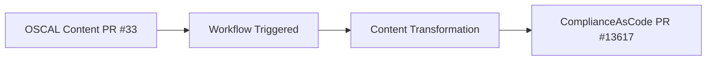
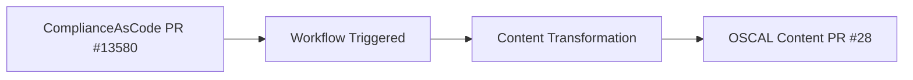

## Step xyz: Deep dive into `ComplianceAsCode/oscal-content` 

_This repository houses authored OSCAL content initialized by complyscribe_

After completing the thorough review of the projects and tools in _Step 1: Read the docs_ you can strengthen your understanding by example.

## Mapping `oscal-content-demo` to the `ComplianceAsCode/oscal-content`

### Bidirectional Synchronization
Stay updated wth content changes where `sync-oscal-cac` and `sync-cac-oscal` make sure that the _back and forth_ exchange of information is accurate. 

#### `sync-oscal-cac` 

Once there is a change made in the `oscal-content` repository, there is an automatic trigger that transforms the `ComplianceAsCode/content` content and requests a change to that material. 

_Goal: updates should be synchronized and accurate_

Above, the PR in the `oscal-content` will trigger the workflow and make sure the changes are initialized by `complyscribe` and sending that back to the `ComplianceAsCode/content` repository.

The updates automatically trigger the request to propose changes to the `ComplianceAsCode/content` repository content. The deletion of rules from the `component-definition.json` trigger the automatic generation of this [PR](https://github.com/ComplianceAsCode/content/pull/13680) in `ComplianceAsCode/content`. The PR proposes changes to the levels applied to te control file [cis_rhel8](https://github.com/ComplianceAsCode/content/pull/13680/files#diff-c97f4c1b44844a9d76570cbbc2bf8fdbceb1dc1076461fc8408870ab612cad9cR33) in `ComplianceAsCode/content`

#### `sync-cac-oscal`

Once there is a change in the `ComplianceAsCode/content` content, there is an automatic trigger that will transform the content that `complyscribe` handles and then requests for that transformed change to be placed back in the `ComplianceAsCode/oscal-content` repository. 

> I know you're probably wondering why this is important...but, check this out!

Above, the control file defines the RHEL8 HIPAA profile. The change makes it simpler to reference this [hipaa control file](https://github.com/ComplianceAsCode/content/blob/master/controls/hipaa.yml) in the [RHEL8 HIPAA Profile](https://github.com/ComplianceAsCode/content/blob/master/products/rhel8/profiles/hipaa.profile). The rules associated with the controls are now in the control file and referenced in the RHEL8 Profile. The table below outlines the Rule, `ComplianceAsCode/content` representation, and the PDF reference to the requirement that the rule satisfies.

| Rule                            | ComplianceAsCode/content                                                                                                                                                                                                  | PDF Format                                                                                                                                                                                                                                           |
|---------------------------------|---------------------------------------------------------------------------------------------------------------------------------------------------------------------------------------------------------------------------|------------------------------------------------------------------------------------------------------------------------------------------------------------------------------------------------------------------------------------------------------|
| coreos_disable_interactive_boot | [coreos_disable_interactive_boot](https://github.com/ComplianceAsCode/content/blob/213ff61cc3ea47773f478297e95d559fb6a15a6d/linux_os/guide/system/accounts/accounts-physical/coreos_disable_interactive_boot/rule.yml#L4) | [Risk Management 164.308(a)(1)(ii)(B)](https://www.ecfr.gov/current/title-45/part-164/section-164.308#p-164.308(a)(1)(ii)(B))                                                                                                                        |
| disable_ctrlaldel_burstaction   | [disable_ctrlaldel_burstaction](https://github.com/ComplianceAsCode/content/blob/213ff61cc3ea47773f478297e95d559fb6a15a6d/linux_os/guide/system/accounts/accounts-physical/disable_ctrlaltdel_burstaction/rule.yml#L4)    | [Risk Management 164.308(a)(1)(ii)(B)](https://www.ecfr.gov/current/title-45/part-164/section-164.308#p-164.308(a)(1)(ii)(B)), [Risk Management 164.308(a)(7)(i)](https://www.ecfr.gov/current/title-45/part-164/section-164.308#p-164.308(a)(7)(i)) |

The control ids are updated in the OSCAL Content PR #28 triggered by the update in ComplianceAsCode/content. The `oscal-content` profiles for RHEL8/HIPAA - [rhel8-hipaa-required](https://github.com/ComplianceAsCode/oscal-content/blob/1bf63ff5e400f1bd4934007e5251a586cbcafa7a/profiles/rhel8-hipaa-required/profile.json)

#### Self-assessment

_Let's see what you've learned_

Take the [self-assessment](https://form.typeform.com/to/EwVRNkJ4) once you have completed Step 2: _Initializing oscal-content-demo with complyscribe_.

##### What You'll Submit

Once completing Step 2: _Initializing oscal-content-demo with complyscribe_, you will have made changes on the `develop` branch of your `oscal-content-demo` repository. 

The changes made will be reflected in your Pull Request. Copy and paste the link of your Pull Request in the self-assessment. 

> Example: "ComplyTime Learning Course: {YOUR_NAME}."

> 🗄️ Where you can find this content

Having trouble? 🤷
 

- Reference the complyscribe [`README.md`](https://github.com/complytime/trestle-bot/blob/main/README.md).
- [The guide for navigating public templates](https://docs.github.com/en/repositories/creating-and-managing-repositories/creating-a-repository-from-a-template)
- (replace-me: Additional troubleshooting tips as needed)

