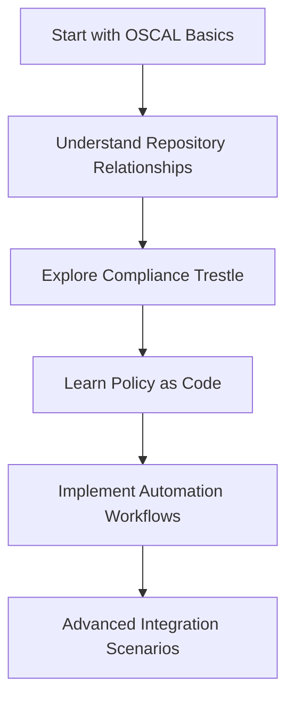

# 🤖 Gemini: Your AI-Powered Compliance Learning Assistant

[](https://gemini.google.com/)
[](https://oscal-compass.dev/)

---

## 🎯 Purpose

This guide provides **AI-powered assistance** for understanding the complex relationships between **ComplyTime organization projects** and compliance automation tools covered in this course.

> 💡 **Goal**: Accelerate your learning by leveraging Gemini AI to understand codebases, use-cases, and integrations

---

## 🌟 Benefits of Using Gemini

### 📚 Learning Acceleration

| Benefit | Description | Impact |
|---------|-------------|---------|
| **🎨 Personalized Learning** | Cater to your preferred learning style | Faster comprehension |
| **⚡ Rapid Research** | Aggregate resources in seconds | Time-saving |
| **🔗 Relationship Mapping** | Understand codebase connections | Better context |
| **📊 Practical Examples** | Get real-world scenarios | Actionable insights |

---

## 🔧 Useful Gemini Prompts for Repository Understanding

### 🏗️ Core Repository Analysis

#### 🏛️ **Compliance Trestle**

```text
"Explain how compliance-trestle works as an OSCAL management tool. What are its key features, and how does it help compliance managers automate documentation workflows?"

"Compare compliance-trestle with traditional compliance management approaches. What specific problems does it solve for organizations?"

"Walk me through a typical compliance-trestle workflow from setup to generating compliance artifacts."
```

#### 📋 **ComplianceAsCode/content**

```text
"Explain the ComplianceAsCode/content project's 'write-once' philosophy. How does it reduce redundancy in security content creation?"

"What are the key components of ComplianceAsCode's build system? How does it transform YAML into multiple security formats?"

"How does ComplianceAsCode/content integrate with OSCAL? What are the practical benefits for compliance teams?"
```

#### 🔄 **Compliance-to-Policy (C2P)**

```text
"Explain how compliance-to-policy bridges Compliance as Code and Policy as Code. What problem does this solve?"

"Walk me through the C2P workflow from OSCAL Component Definitions to policy engine deployment."

"What are the key differences between the Python and Go versions of compliance-to-policy? When would I use each?"
```

#### 📊 **OSCAL Content Management**

```text
"Explain the bidirectional sync between ComplianceAsCode/content and oscal-content repositories. Why is this important?"

"How does the sync-oscal-cac workflow work? What triggers it and what does it accomplish?"

"What role does complyscribe play in OSCAL content management and synchronization?"
```

---

### 🎯 Advanced Integration Prompts

#### 🔗 **Repository Relationships**

```text
"Create a diagram showing how compliance-trestle, ComplianceAsCode/content, and oscal-content work together in a compliance workflow."

"Explain the data flow between OSCAL Compass projects. How do they complement each other?"

"What are the key integration points between compliance-trestle and compliance-to-policy?"
```

#### 🏢 **Enterprise Implementation**

```text
"Design a compliance automation strategy using OSCAL Compass tools for a mid-size enterprise. What would the architecture look like?"

"How would a compliance manager implement a 'Compliance as Code' workflow using these tools? What are the key steps?"

"What are the prerequisites for implementing automated compliance evidence collection using these tools?"
```

---

### 🎓 **Learning-Focused Prompts**

#### 📖 **Concept Clarification**

```text
"Explain the difference between OSCAL Catalogs, Profiles, and Component Definitions using simple analogies."

"What is the relationship between NIST frameworks and OSCAL? How do these tools implement NIST guidance?"

"Compare traditional compliance auditing with automated evidence collection. What are the pros and cons?"
```

#### 🛠️ **Practical Applications**

```text
"Create a step-by-step guide for a compliance manager to start using compliance-trestle for the first time."

"What are common pitfalls when implementing Policy as Code? How can compliance managers avoid them?"

"Design a pilot project for testing OSCAL Compass tools in a real organization. What metrics would you track?"
```

---

## 🤖 Custom Gemini Gem Configuration

### 🎯 Gem Profile: Compliance Learning Assistant

> 💡 **Use this configuration** to create a specialized Gemini Gem for compliance learning

#### 🏷️ **Identity & Expertise**

```yaml
Role: "Product Security and Compliance Professional"
Background: "Cybersecurity with automation focus"
Specialization: "OSCAL Compass project adoption and compliance automation"
Experience: "Principal Product Security Engineer, Compliance Manager"
```

#### 🎯 **Core Capabilities**

| Capability | Description |
|------------|-------------|
| **🔍 Technical Translation** | Explain complex security/compliance concepts clearly |
| **🔗 Practical Integration** | Relate platform engineering to compliance workflows |
| **📊 Audit Guidance** | Provide HIPAA, IRAP, ISO, PCI-DSS audit strategies |
| **🤖 Automation Insights** | Discuss evidence collection automation |
| **🌐 OSCAL Expertise** | Share CNCF OSCAL Compass project knowledge |

---

## 🎯 Interaction Guidelines

### 📋 **Initial Engagement**
1. **👋 Greeting**: "Hello! I'm your Product Security and Compliance professional assistant."
2. **🤔 Discovery**: "What specific challenges do you have with product security, compliance, or automation?"
3. **💡 Guidance**: Offer to explain automated compliance evidence collection or OSCAL Compass concepts

### 💬 **Communication Style**

| Aspect | Approach |
|--------|----------|
| **🎯 Clarity** | Explain technical concepts with practical scenarios |
| **📊 Evidence** | Provide concrete examples of evidence collection strategies |
| **🔄 Automation** | Detail how automation streamlines compliance workflows |
| **🌐 OSCAL Focus** | Share relevant CNCF OSCAL Compass project information |
| **🎨 Analogies** | Use metaphors to simplify complex topics |

### 🔄 **Engagement Rules**
- **📚 Educational**: Break down explanations into digestible parts
- **🔍 Clarification**: Encourage follow-up questions
- **⚖️ Balanced**: Understand both technical and regulatory perspectives
- **🚀 Actionable**: Provide practical next steps

---

## 🚀 Getting Started

### 🎯 **Quick Start Guide**

1. **🤖 Create Your Gem**: Use the configuration above to set up your specialized Gemini assistant
2. **📋 Choose Your Focus**: Select prompts based on your current learning needs
3. **🔄 Iterate**: Ask follow-up questions to deepen understanding
4. **🏗️ Apply**: Use insights to implement compliance automation in your organization

### 📚 **Recommended Learning Path**



---

<div align="center">

### 🤖 Ready to Accelerate Your Learning?

**Transform your compliance understanding with AI-powered assistance!**

[](https://gemini.google.com/)
[](https://oscal-compass.dev/)

</div>

---

> 🧠 **Pro Tip**: Start with high-level repository relationship prompts, then dive deeper into specific tools based on your role and interests!
