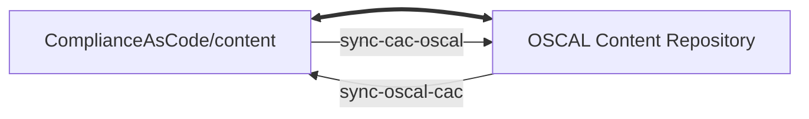
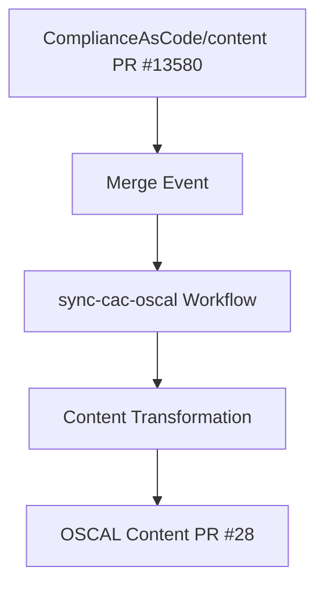
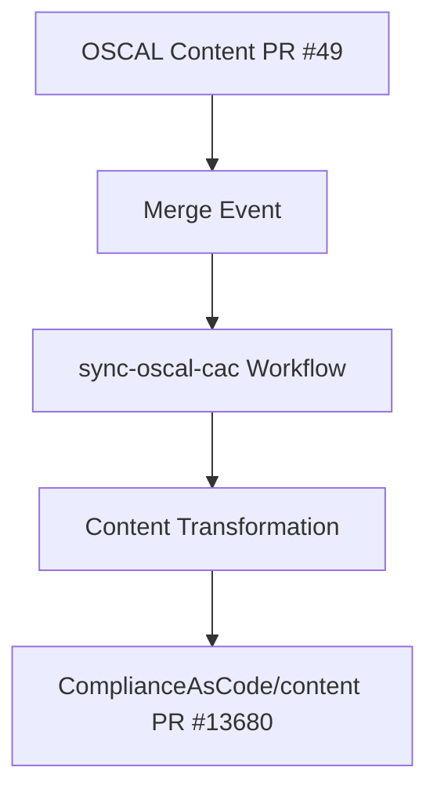
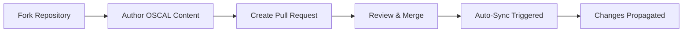

# 📚 OSCAL Content Repository Overview

---

## 🌟 Repository Purpose

This repository serves as a **centralized location** for managing and storing security compliance content in the [**Open Security Controls Assessment Language (OSCAL)**](https://pages.nist.gov/OSCAL/) format.

> 🎯 **Primary Focus**: Managing OSCAL content with current emphasis on **Red Hat (RH)** products

---

## 🚀 System Overview

### 🤖 Initialized by ComplyScribe

The repository was initialized by [**complyscribe**](https://github.com/complytime/complyscribe), providing intelligent OSCAL content management and synchronization capabilities.

### 🔧 GitHub Actions Workflows

| Workflow | Purpose | Direction | Repository |
|----------|---------|-----------|------------|
| **`sync-comp`** | Generate OSCAL component content | ➡️ **Inbound** | [ComplianceAsCode/content](https://github.com/ComplianceAsCode/content) |
| **`sync-controls`** | Generate OSCAL control content | ➡️ **Inbound** | [ComplianceAsCode/content](https://github.com/ComplianceAsCode/content) |
| **`sync-oscal-cac`** | Sync OSCAL updates to CAC | ⬅️ **Outbound** | [ComplianceAsCode/content](https://github.com/ComplianceAsCode/content) |

### 🔄 Bidirectional Synchronization

The **`sync-oscal-cac`** and **`sync-cac-oscal`** workflows create a powerful **bi-directional synchronization** system:

> 🔗 **Integration**: Paired with [sync-cac-oscal](https://github.com/ComplianceAsCode/content/blob/master/.github/workflows/sync-cac-oscal.yml) for complete synchronization

---

## ⚙️ Content Synchronization Process

> ⚠️ **Development Status**: The CI systems are currently in development. The user experience will be refined as we gather feedback from ongoing use.

### 📥 Content Transformation: CAC to OSCAL

The **`sync-cac-oscal`** workflow handles transformation from ComplianceAsCode/content into OSCAL format, powered by the `complyscribe` command-line tool.

#### 🔄 Workflow Stages

| Stage | Action | Description |
|-------|--------|-------------|
| **1** | 🔍 **Detect Changes** | Identifies relevant updates in source content directories (controls, profiles, rules, vars) |
| **2** | 🛠️ **Prepare for Transformation** | Gathers necessary arguments required by the Complyscribe CLI |
| **3** | 🔄 **Transform Content** | Runs `complyscribe` to convert source files into corresponding OSCAL formats |
| **4** | 📝 **Propose Updates** | Automatically creates pull request with newly generated OSCAL content |

#### 📊 Real-World Example

**Live Example**:
- **Trigger**: ComplianceAsCode/content [PR #13580](https://github.com/ComplianceAsCode/content/pull/13580) merged
- **Workflow**: Successful [run](https://github.com/ComplianceAsCode/content/actions/runs/15688668981/job/44198205023)
- **Result**: Auto-created oscal-content [PR #28](https://github.com/ComplianceAsCode/oscal-content/pull/28)

---

### 📤 Content Transformation: OSCAL to CAC

The **`sync-oscal-cac`** workflow handles reverse synchronization, ensuring OSCAL content updates are reflected back in ComplianceAsCode/content repository.

#### 🔄 Workflow Process

| Stage | Action | Description |
|-------|--------|-------------|
| **1** | ⚡ **Trigger** | Activated upon merge of pull request containing OSCAL file changes |
| **2** | 🔍 **Detect OSCAL Updates** | Identifies which OSCAL files (catalogs, profiles, component-definitions) were updated |
| **3** | 🔄 **Sync with ComplyScribe** | Calls Complyscribe CLI to transform OSCAL updates back to standard format |
| **4** | 📝 **Create Upstream PR** | Automatically creates new pull request in ComplianceAsCode/content repository |

#### 📊 Real-World Example

**Live Example**:
- **Trigger**: OSCAL content [PR #49](https://github.com/ComplianceAsCode/oscal-content/pull/49) merged
- **Workflow**: Successful [run](https://github.com/ComplianceAsCode/oscal-content/actions/runs/16161128581/job/45612912892)
- **Result**: Auto-created ComplianceAsCode/content [PR #13680](https://github.com/ComplianceAsCode/content/pull/13680)

---

## 🛠️ Tooling

### 🎯 ComplyScribe Integration

We utilize **ComplyScribe** to help author and manage OSCAL content, ensuring it adheres to required standards and formats.

#### 🔧 Key Features

| Feature | Benefit |
|---------|---------|
| **📝 Content Authoring** | Streamlined OSCAL content creation |
| **✅ Standards Compliance** | Ensures adherence to OSCAL specifications |
| **🔄 Format Management** | Consistent content formatting |
| **🤖 CLI Integration** | Seamless automation workflows |

> 🔗 **Learn More**: [ComplyScribe Documentation](https://github.com/complytime/complyscribe)

---

## 🤝 Contributing

### 🚀 Content Authoring Process

**Maintainers** can contribute through the following workflow:

#### 📋 Step-by-Step Guide

1. **🍴 Fork Repository**: Create a fork of the OSCAL content repository
2. **✏️ Author/Edit Content**: Modify OSCAL content files in your fork
3. **📝 Create Pull Request**: Submit your changes for review
4. **👥 Review Process**: Collaborate with maintainers on improvements
5. **✅ Merge**: Once approved, changes are merged
6. **🔄 Auto-Sync**: The `sync-oscal-cac` workflow triggers automatically

#### 🔄 Contribution Workflow

---

## 📈 Benefits

### 🎯 Key Advantages

| Benefit | Description |
|---------|-------------|
| **🔄 Automated Synchronization** | Bidirectional content sync reduces manual effort |
| **📊 Centralized Management** | Single source of truth for OSCAL content |
| **🤖 CI/CD Integration** | Automated workflows ensure consistency |
| **🔗 Standards Compliance** | Built-in OSCAL format validation |
| **👥 Collaborative Development** | Fork-based contribution model |

---

### 🚀 Ready to Contribute?

**Transform your compliance content management with automated OSCAL synchronization!**

---

> 🔄 **Automation**: Bidirectional synchronization ensures your compliance content stays consistent across all platforms automatically! 