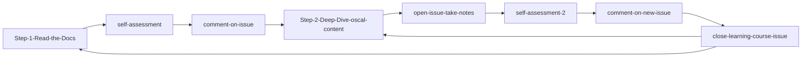

## Creating a new GitHub issue to take notes

**Click "Issues"**

 

**Click "New issue"**

**Choose the "Learning Course Issue Template"**

**Create a new issue using the template. Use the template to guide your notes.**

**New issue created**

